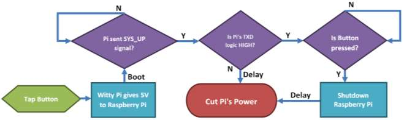

WittyPi 4
---

This repository holds implementations for alternative WittyPi 4 usage with modern linux distributions.

# Basic usage

The basic workflow followed by the WittyPi is described in the figure cited from UUGear's manual:



To enable turning the Raspberry Pi on and shutting it down gracefully, one can make use of existing dtoverlays, described in `/boot/firmware/overlays/README`:

```
Name:   gpio-shutdown
Info:   Initiates a shutdown when GPIO pin changes. The given GPIO pin
        is configured as an input key that generates KEY_POWER events.
...
Name:   gpio-led
Info:   This is a generic overlay for activating LEDs (or any other component)
        by a GPIO pin.
```

WittyPi uses inverted logic for the shutdown button, i.e. `active_high`. Also the virtual button press is quite short (can be < 1ms), hence debouncing shoud be disabled. Using the following entries in `/boot/firmware/config.txt`, sysup and shutdown is made available:

```ini
dtoverlay=gpio-shutdown,gpio_pin=4,debounce=0,active_low=0
dtoverlay=gpio-led,gpio=17,label=sysup,trigger=heartbeat
```

> Note: The SYSUP signal `(0, 1, 0, 1)` in 100ms intervals is sent using the trigger `heartbeat`, as this by accident matches the required interval. 

## Real Time Clock (RTC) Linux Driver

Witty Pi 4 exposes the PCF85063 through the MCU at I2C address `0x08`, with RTC registers windowed at offset `0x36`. The MCU also rejects bulk I2C transfers (bulk reads come back as `0xff`).

This repository does **not** fork `rtc-pcf85063`. Module `rtc-pcf85063-wittypi4` is a nested I2C adapter that:

- adds `0x36` to the register byte and forwards to the MCU at `0x08`
- splits bulk / combined transfers into single-byte accesses
- retries NAK / MCU-not-ready a few times on first access
- instantiates a child client (`pcf85063a` at virtual address `0x51`) for the **in-tree** `rtc-pcf85063` driver

`CONFIG_RTC_DRV_PCF85063` (module `rtc-pcf85063`) must be enabled. The overlay does not wire an RTC IRQ, so kernel alarms stay off (the MCU uses the alarm itself).

The overlay compatible list is `"uugear,wittypi4-rtc-proxy", "nxp,pcf85063wp"` so existing `nxp,pcf85063wp` nodes still bind.
### Compile & Install module

The module can either be compiled using the Makefile, i.e. `make; sudo make install` or via dkms:

```bash
# copy driver source files
sudo cp -R /home/pi/wittypi4/rtc-pcf85063-wittypi4 /usr/src/rtc-pcf85063-wittypi4-1.0
# install & compile using dkms
sudo dkms install rtc-pcf85063-wittypi4/1.0
```

### Device Tree Overlay / Raspberry Pi

To load the driver and make the RTC accessible to the Raspberry Pi a device tree overlay can be used ([wittypi4-overlay.dts](./wittypi4-overlay.dts)). To use this overlay it needs to be compiled and loaded:

```bash
# compile to dtbo 
dtc -O dtb -o wittypi4.dtbo wittypi4-overlay.dts
# create overlay location
sudo mkdir -p /sys/kernel/config/device-tree/overlays/wittypi4
# copy dtbo to kernel interface
sudo cp wittypi4.dtbo /sys/kernel/config/device-tree/overlays/wittypi4/dtbo
```

Of course the dtbo can also be loaded using an `config.txt` entry inside, when copying the dtbo to the respective location:

```bash
# copy dtbo to overlay folder
sudo cp wittypi4.dtbo /boot/firmware/overlays/
# append dtoverlay to config.txt
sudo tee -a /boot/firmware/config.txt <<<dtoverlay=wittypi4
```

### TxD power cut

WittyPi recogices a the Raspberry Pi's shutdown by monitoring the TxD output. This mostly works reliable, but sometimes leads to a hangup where the Raspberry Pi shutdown, but TxD is still high and power is not cut. 

To make this more reliable a systemd service can be created, that forcefully sets GPIO 14 low (and thereby disables TxD / the serial console). An example service is to be found in `[/etc/wittypid-power.service](/etc/wittypid-power.service)`.

# Python API

This repository includes a Python library for programmatic control of the WittyPi 4.

## Installation

Install the library using pip or pdm:

```bash
# Using pip
pip install -e .

# Using pdm
pdm install
```

## Quick Example

```python
import smbus2
from wittypi4 import WittyPi4
import datetime

# Initialize WittyPi 4
bus = smbus2.SMBus(1, force=True)
wp = WittyPi4(bus)

# Read hardware status
print(f"Input: {wp.voltage_in}V, Output: {wp.voltage_out}V @ {wp.current_out}A")
print(f"Temperature: {wp.lm75b_temperature}°C")
print(f"RTC Time: {wp.rtc_datetime}")

# Schedule next startup in 1 hour
wp.set_startup_datetime(datetime.datetime.now() + datetime.timedelta(hours=1))
```

## Running the Daemon

The `wittypid` daemon manages schedules automatically:

```bash
# Run with default schedule.yml
wittypid

# Run with custom schedule file
wittypid -s /path/to/schedule.yml

# Verbose output
wittypid -vv
```

For production use, install as a systemd service (see `etc/wittypid-power.service`).

## Documentation

For complete API reference, examples, and advanced usage, see:
- [Python API Documentation](docs/API.md) - Complete API reference for developers
- [schedule.yml](schedule.yml) - Example schedule configuration

## Resources

### Datasheets
- [WittyPi 4](https://www.uugear.com/doc/WittyPi4_UserManual.pdf)
- [PCF85063A](https://www.nxp.com/docs/en/data-sheet/PCF85063A.pdf) (RTC)
- [LM75B](https://www.ti.com/lit/ds/symlink/lm75b.pdf)
